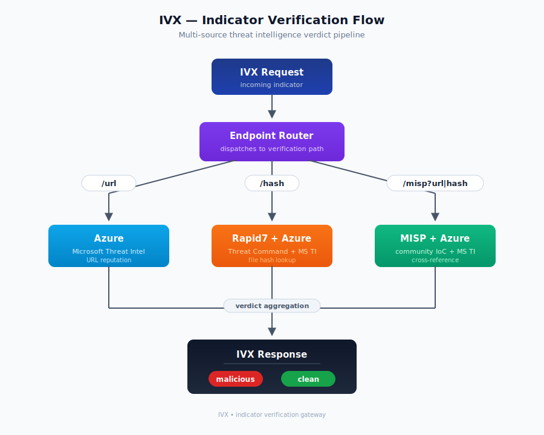

[]
# IVX Intelligence Wrapper (Azure OpenAI - Python)

## Overview

A sophisticated REST service that bridges **Trellix IVX Cloud** with **Azure OpenAI** large language models to provide intelligent, context-enriched classification of URLs and file hashes as malicious or benign. This wrapper implements a multi-stage intelligence pipeline that combines threat intelligence from multiple sources with AI-powered classification to deliver accurate, explainable security verdicts.

### Key Capabilities

- **Multi-Source Threat Intelligence**: Integrates Rapid7 Threat Intelligence and MISP for enriched classification context
- **Azure OpenAI Classification**: Leverages GPT models with zero-temperature deterministic responses for consistent verdicts
- **Three Classification Pipelines**: 
  - Direct Azure OpenAI analysis (URL)
  - Rapid7-enriched analysis (Hashes)
  - MISP-based intelligence-driven analysis (URL/Hash)
- **Auto-Detection**: Automatically identifies indicator types (URL, SHA256, SHA1, MD5)
- **IVX-Compliant**: Returns verdicts in Trellix IVX Cloud-compatible JSON format
- **Structured Logging**: Complete audit trail with JSON logs for all operations
- **Fast Rejection**: Returns "clean" immediately for unknown/safe indicators (cost optimization)

### Why This Wrapper?

Traditional malware detection relies on static signatures and known patterns. This wrapper enhances detection capabilities by:

1. **Leveraging AI Context**: Azure OpenAI understands threat landscape, campaigns, malware families, and attacker TTPs
2. **Multi-Source Correlation**: Cross-references indicators against Rapid7 and MISP to validate findings
3. **Campaign Attribution**: Identifies specific threat campaigns (e.g., "Grandoreiro banking trojan") in MISP data
4. **Cost Optimization**: Skips expensive OpenAI calls for already-known clean/malicious indicators
5. **Audit Trail**: Complete logging for compliance and incident investigation

---

## Configuration

1. Copy `.env.example` to `.env`.
2. Fill in your Azure OpenAI credentials:
   - `AZURE_OPENAI_ENDPOINT`: Your Azure OpenAI resource URL (e.g., `https://my-resource.openai.azure.com/`).
   - `AZURE_OPENAI_KEY`: Your API key.
   - `AZURE_OPENAI_DEPLOYMENT_ID`: The deployment name of your GPT model.
   - `AZURE_OPENAI_API_VERSION`: API version (default: `2023-05-15`).

## Installation

```bash
pip install -r requirements.txt
```

## Running

### Local
```bash
python main.py
# OR
uvicorn main:app --port 3030
```

### Docker
```bash
docker build -t ivx-wrapper-py .
docker run -p 3030:3030 --env-file .env ivx-wrapper-py
```

## Endpoints

### URL Analysis
- **Endpoint**: `/analyze/url?url=<URL>`
- **Method**: GET
- **Response**: IVX-compliant JSON.

### Hash Analysis
- **Endpoint**: `/analyze/hash?hash=<HASH>`
- **Method**: GET
- **Response**: IVX-compliant JSON (supports SHA256).

## Architecture & Classification Flow

### System Architecture

The wrapper implements three distinct classification pipelines:

[](images/ivx-flow.svg)

### Endpoint 1: `/analyze/url` - Direct URL Classification

**Flow:**
1. Accept URL query parameter
2. Send prompt to Azure OpenAI: "Classify this URL as malicious or clean"
3. Parse OpenAI response (JSON format)
4. Return IVX-compliant verdict

**Use Case:** Fast, lightweight URL classification without external threat intelligence context.

**Response Example:**
```json
{
  "data": {
    "result": {
      "verdict": "malicious",
      "signature": "azure_phishing_site"
    }
  }
}
```

### Endpoint 2: `/analyze/hash` - Hash Classification with Rapid7 Context

**Flow:**
1. Accept SHA256 hash query parameter
2. **Lookup Rapid7 Threat Intelligence API**
   - If hash returns **204 (Not Known)** → Return `clean` immediately (skip OpenAI)
   - If hash found → Extract threat data (category, tags, event info)
   - If error/missing creds → Continue without context
3. **Send to Azure OpenAI** with Rapid7 context (if available)
   - Prompt: "Assess if this file hash is malicious/clean based on provided threat intelligence context"
4. Parse OpenAI response
5. Return verdict with signature `azure_<tag>`

**Rapid7 Lookup Benefits:**
- Provides authoritative threat intelligence from Rapid7's database
- Returns early with "clean" verdict for unknown/safe hashes (performance optimization)
- Enriches OpenAI decision with real threat data (malware family, behavior, confidence)

**Response Example:**
```json
{
  "data": {
    "result": {
      "verdict": "malicious",
      "signature": "azure_trojan_emotet"
    }
  }
}
```

### Endpoint 3: `/analyze/misp` - MISP-Enriched Classification

**Flow:**
1. Accept `url` or `hash` query parameter
2. **Auto-detect indicator type:**
   - URLs: starts with http/https or matches domain pattern
   - SHA256: 64 hex characters
   - SHA1: 40 hex characters  
   - MD5: 32 hex characters
3. **Lookup in MISP:**
   - Query MISP with detected type (e.g., `type: "sha256"`)
   - If not found → Return `clean` with signature `misp_not_found` (no OpenAI call)
   - If found → Extract `Event.info` field (campaign/threat description)
4. **Normalize MISP info to tag:**
   - "Campagna Grandoreiro generica" → `misp_campagna_grandoreiro_generica`
5. **Send to Azure OpenAI** with MISP context
   - Prompt includes full MISP threat data
   - OpenAI classifies based on campaign/threat intelligence
6. Return verdict with signature `misp_<threat_description>`

**MISP Lookup Benefits:**
- Leverages organizational threat intelligence database
- Fast rejection for unknown indicators (no OpenAI cost)
- Signature includes actual threat campaign/malware name
- Automatic indicator type detection (URL/hash format agnostic)

**Response Examples:**

*Indicator found in MISP:*
```json
{
  "data": {
    "result": {
      "verdict": "malicious",
      "signature": "misp_trojan_emotet_banking"
    }
  }
}
```

*Indicator not found in MISP:*
```json
{
  "data": {
    "result": {
      "verdict": "clean",
      "signature": "misp_not_found"
    }
  }
}
```

---

## IVX Configuration

### Engine URL
- **Endpoint**: `/analyze/url?url={{url}}`
- **Flow**: Direct Azure OpenAI classification

### Engine HASH  
- **Endpoint**: `/analyze/hash?hash={{sha256}}`
- **Flow**: Rapid7 context + Azure OpenAI classification

### Engine MISP (Optional)
- **Endpoint**: `/analyze/misp?url={{url}}` or `/analyze/misp?hash={{sha256}}`
- **Flow**: MISP enrichment + Azure OpenAI classification

### Parsing Rules
- **Verdict Key**: `data.result.verdict`
- **Verdict Value**: `malicious` | `clean`
- **Signature Key**: `data.result.signature`
